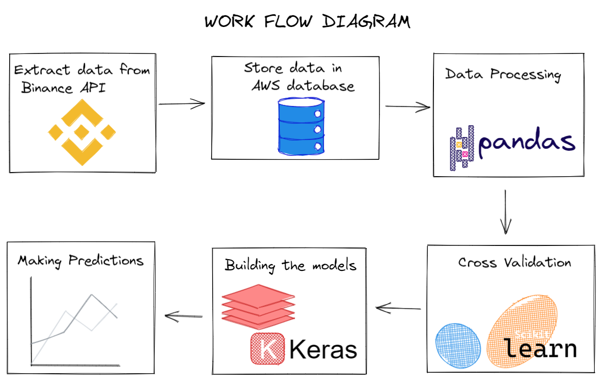

# Crypto Prediction

## Team members
* [Abdurrahman Raja](https://github.com/Abzraja)
* [James Lilley](https://github.com/jimbleslilley)
* [Serdar Bayramov](https://github.com/serdar-bayramov)
* [Tom Oldershaw](https://github.com/TomHOldershaw)

## Project overview
The project is designed to predict the future value of crypto currency. The data extracted covers a number of coins, and in theory there is no restriction on the application of the model, subject to re-training the model for each coin. 

At present, the project produces models only for Ethereum.

## Intended use
The intended use of the project is to produce forecasts of coin prices to inform investment decisions. With time, the intention is to develop a front end to display these predictions. In this use case, the trained model would be used to forecast from the latest price points obtained from the API at the point of prediction.

## Project steps
The project steps are illustrated below.

Technical details are provided on key stages in this process:
 - [Model investigation](documentation.md#model)
 - [Linear Regression model](documentation.md#lr)
 - [Long Short Term Memory model](documentation.md#lstm)

Model notebooks are:
 - [Cross Validation and Linear Regression Test 1](notebooks/01%20-%20Cross%20Validation.ipynb)
 - [Cross Validation and Linear Regression Test 2](notebooks/02%20-%20Predicting%20the%20future%20price%20of%20ethereum%20-%20shifting%20the%20target.ipynb)
 - [Cross Validation and Linear Regression Test 3](notebooks/03%20-%20Predicting%20the%20future%20price%20of%20ethereum%20-%20Adding%20Features%20which%20are%20shifted.ipynb)
 - [RNN: Long Short Term Memory and GRU](notebooks/ETH_RNN_1.ipynb)

# Conclusions
We investigated several model forms, and developed models for two of them. Following this work, we would recommend adopting the GRU model for further development
