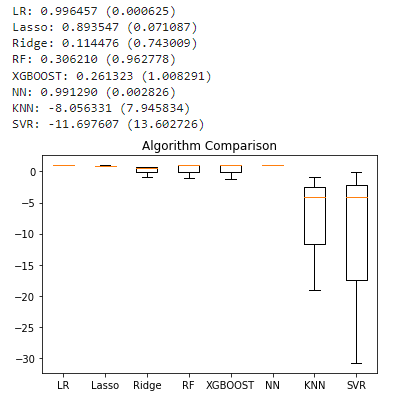
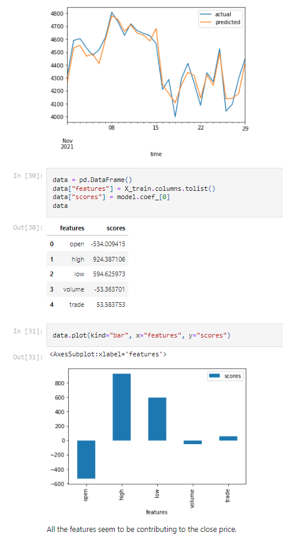
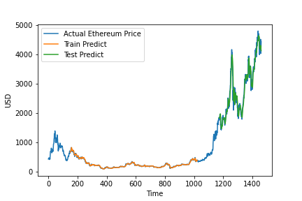
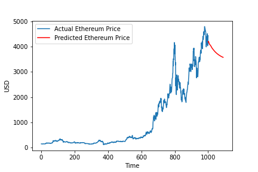

# Documentation

This file details the steps taken in producing the models, highlighting differences both in model form and in the required data processing to produce the right data for each model.

# Model investigation

## Data Processing

* We filter the Etherium results from our SQL table as we are building a model to predict Etherium values. 

* Analyise for null values (of which there were none is our dataset). 

* We then set our index, the correct format for datatime and convert all dimensions to numerical values. 

## Model Selecting

* For this model, we want to be able to predict the closing value of Etherium and set this our label. Meanwhile all other features become our X values. 

As our data is time-dependent, we need to use times series split for validation. 

n_splits = 3. As we have 4 years of data it will split like this:

### 1st Split: 

TRAIN: Year 1

TEST: Year 2

### 2nd Split: 

TRAIN: Year 1 and Year 2

TEST: Year 3

### 3rd Split: 

TRAIN: Year 1, Year 2 and Year 3

TEST: Year 4

### Cross-Validation
Several model forms were compared. After conducting our algorithm comparison, we can see that linear regression (LR) and neural networks (NN) both have high scores. These models were therefore carried forward for further investigation.

# Linear Regression Model

At this point, we can proceed with creating training and test sets for our linear regression model.

After running our linear regression model, we received a r-score of 0.9194767095962151. Plotting our model's predictions can be found below along with the feature coefficients.

# LSTM (Long Short Term Memory) model 

LSTM model is part of RNN (Recurrent Neural Networks) which is extensively used for prediction modelling that involves sequential data. In this project, we are using LSTM model to predict the price of crypto currency (Ethereum).

## Data Processing for LSTM model

* We select the ethereum_usdt from the dataset, and since we are only interested in 'close' price, on which we are going to make predictions, we select the column 'close' price.

* Data Normalisation is an important step as the prices are extremely fluctuating. Using MinMaxScaler, we normalise the data from 0 to 1.

* The Dataset was split into Train and Test in the form of 70% - Train dataset, 30% - Test dataset.

Train, Test shapes: (1023,1),(439,1)

* For LSTM model, the shape of input data needs to be 3D Tensor of (samples, time steps, features). Therefore, the transformation of dataset for LSTM was prepared in the following fashion: 

X = numpy.reshape(df, len(df), timestep, 1))

where:

Samples - len(df)
Time steps - width of the sliding window
Features - number of features in every time step

* The timestep is a "look back period" which defines how many previous timesteps are used in order to predict the subsequent timestep. For crypto prediction, the timestep of 150 was used.

* The function was created which returns the numpy array of the following fashion; it is suitable to feed the LSTM model. 

Final numpy array shape:

X_train.shape = (873,150,1)  
y_train.shape = (873,)  
X_test.shape = (289,150,1)  
y_test.shape = (289,)  

## LSTM model

We use Sequential model from Keras that allows to create a Neural Network object with sequential layers. Then, we add LSTM layers and given that predicting a price of a coin is a quite complex task we use 50 LSTM units per LSTM layer and we use multiple LSTM layers. Finally, we use the Dense module to add an output layer	

 The model was fit was X_train, y_train, for validation X_test and y_test were used, number of epochs = 100 and batch_size of 64. 

In order to evaluate the model accuracy, we applied mean squared error and square root mean squared error from sklearn.metrics. The results were as follows:

Train RMSE: 15.892714065371969  
Train MSE: 252.57836036367203  

Test RMSE: 244.35037085537823  
Test MSE: 59707.103737160876  
R2 score: 0.925749907233176

The ethereum price prediction is made for 14 days into the future. The plots show good matching of train and test data against original ethereum prices, although it is noted that the Test MSE is significantly higher than the Train MSE.

### Tuning

A Keras Tuner class was used to attempt to optimise the model. The tuner was asked to optimise the number of layers and the number of units in each layer. The optimised model was fitted to the data and used to predict results for the test data set.

The best hyperparameter tuning results are as follows:

{'first_units': 35,  
 'num_layers': 1,  
 'units_0': 36,  
 'last_units': 36,  
 'units_1': 2,  
 'units_2': 49,  
 'units_3': 34,  
 'units_4': 40,  
 'units_5': 4,  
 'tuner/epochs': 100,  
 'tuner/initial_epoch': 34,  
}

The same metrics were obtained as before, giving the following results:

Train RMSE: 22.681857033269978  
Train MSE: 514.4666384776988  

Test RMSE: 302.70577078148403  
Test MSE: 91630.78366441235  
R2 score: 0.8860505072004533

It is surprising to note that the 'optimised' model gives lower scores than the original model. Various attempts to alter the optimisation settings did not produce a better model.

### Visualising and predicting

The model results (using the better performing model) were plotted to compare the train and test model results to the actual prices, as shown below.

Using the model, a prediction was also made for prices in the future.

## GRU model

Like LSTM, we use Sequential model from Keras that allows to create a Neural Network object with sequential layers. Then, we add GRU layers and given that predicting a price of a coin is a quite complex task we use 50 LSTM units per LSTM layer and we use multiple LSTM layers. We also used dropout regularisation method to reduce the effect of reducing the overfitting and improving the model performance. Finally, we use the Dense module to add an output layer. 

The model is compiled with 'adam' optimizer and loss='mean_squared_error'

Both LSTM and GRU models performed well for ethereum price prediction. For this particular project, it was decided to proceed with LSTM model. 
